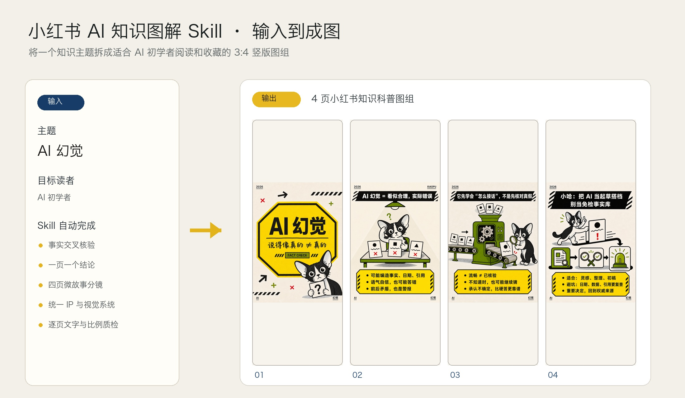

# 小红书 AI 知识图解 Skill

一个面向 AI 初学者的小红书知识科普图组 Skill。它把关键词、长文本、文章、文件或截图转化为至少 4 张、3:4 竖版的知识图：先分析选题并联网交叉核验，再确认页数与逐页分镜，最后统一生成并质检整组图片。



## 主要能力

- 将复杂 AI 概念拆成“一页一个结论”的图组。
- 生成前先做事实核验、选题分析和分镜确认。
- 使用粗黑轮廓、扁平纯色和高对比信息海报版式。
- 可选原创黑白德文卷毛猫“小哈”作为学习型叙事 IP。
- 固定 3:4 竖版、至少 4 页，并逐页检查文字、事实、比例和角色一致性。
- 默认只交付图片，避免自动附加未经要求的小红书正文。

## 安装

把本仓库文件夹复制到 Codex Skills 目录，并确保 `SKILL.md` 位于技能根目录。例如：

```text
~/.codex/skills/xiaohongshu-ai-visual-notes/
├── SKILL.md
├── agents/openai.yaml
└── references/
```

## 使用示例

```text
使用 $xiaohongshu-ai-visual-notes，把“AI 幻觉”做成面向初学者的 4 页小红书知识图。先核验和给分镜，等我确认后再生成。
```

## 仓库结构

```text
xiaohongshu-ai-visual-notes/
├── SKILL.md
├── agents/openai.yaml
├── references/
│   ├── planning-and-qa.md
│   └── visual-system.md
└── examples/
    ├── text-to-carousel-comparison.jpg
    └── ai-hallucination-carousel/
```

`examples/` 中提供了可直接用于 GitHub README 展示的效果图和单页图组。
